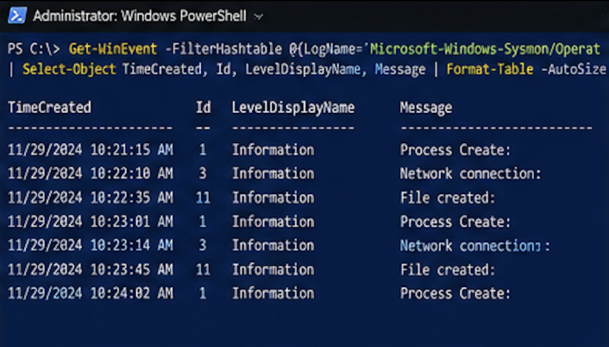
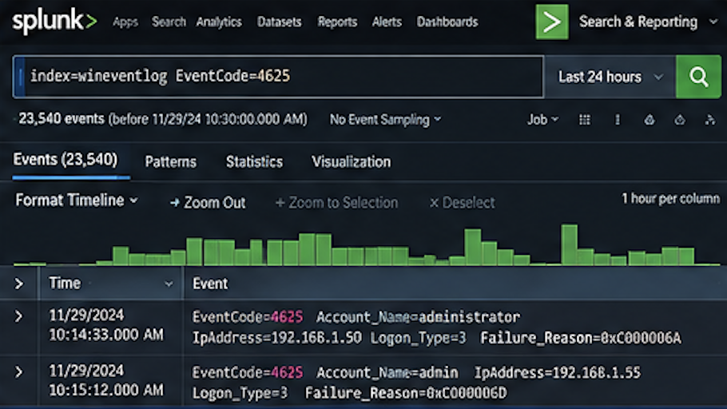
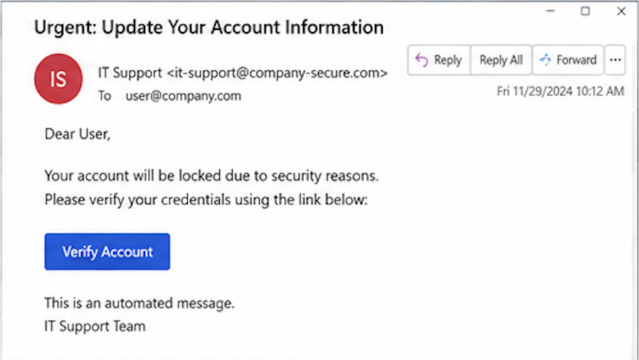
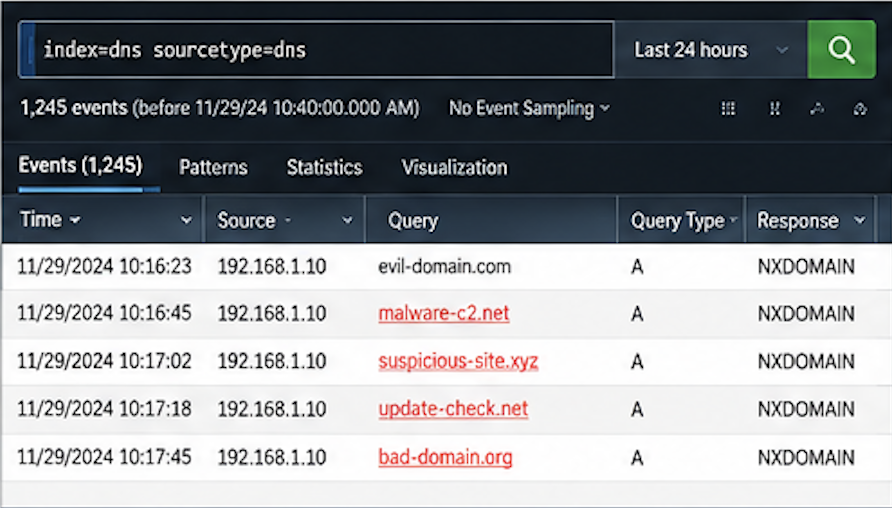

# SOC Lab Screenshots

This directory contains visual references for the SOC lab, including the lab architecture, security monitoring, Windows event analysis, Sysmon telemetry, SIEM-based detection, phishing investigation, suspicious DNS activity, PowerShell investigation, and IOC analysis.

> **Note:** The screenshots in this directory are illustrative/recreated visuals and are not original historical evidence from the previous lab environment.

## Screenshots

### SOC Home Lab Architecture

### pfSense Firewall Dashboard

### Windows Event Logs

### Sysmon Events

### Splunk Brute-Force Detection

### Phishing Email Investigation

### Suspicious DNS Activity

### Suspicious PowerShell Investigation

### IOC Investigation

